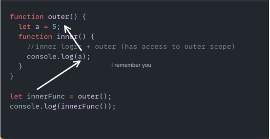

# Recursion дар Java Script чист?
Recursion дар барномасозӣ мисли функсияест, ки худаш худашро даъват мекунад. Вақте ки функсия ин корро мекунанд, онро функсияи рекурсавии муайяншуда меноманд. Аммо, як қоида вуҷуд дорад, ки мо бояд уро иҷро кунем; ин қоида он аст ки бояд функсияи мо қатъ карда шавад, вагарна он то абад кор хоҳад кард.
```js
function Recursion() {
    console.log( );
    setTimeout(Recursion, 0);
}
Recursion();
```
Барои пешгириит рекурсияи беохир, шумо метавонед if ... eslse  (ё ягон методи муайянро истифода баред)

```js
function recursion() {
    if (condition)
    {
        recursion( );
    }
    else{
        // stop calling recursion()
    }
}
Recursion();
```


# Closure дар Java Script чист?
Closure ин  комбинатсияи функисяҳои дарун ба дарун мебошад

